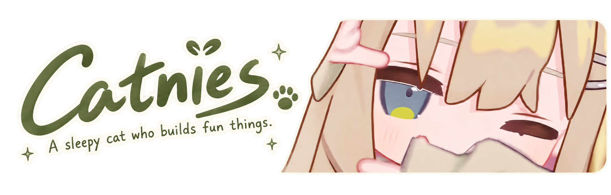
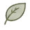
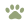

<!--
  Catnies · Profile README
  Decorative assets live in ./assets.
  Dynamic items such as pinned repositories are managed directly on GitHub.
-->

  

  <b>Back-End Developer in Training</b> 
  Building Minecraft plugins, libraries, and small useful things.

  <code>Java</code> &nbsp; <code>Kotlin</code> &nbsp; <code>Minecraft</code> &nbsp; <code>System Design</code>

<table>
<tr>
<td>
  

     &nbsp;
    <em>Turn what I love into something useful, little by little.</em> 
    &nbsp;&nbsp;&nbsp;&nbsp;&nbsp;&nbsp;&nbsp; Code, create, explore... and stay curious.
  

</td>
</tr>
</table>

 About Me

Hi, I'm Catnies.

I mainly work with Java and Kotlin, and I enjoy building Minecraft plugins and libraries. I learn best by making things, polishing them, and sharing them through open source.

I'm especially interested in system design, tooling, and high-performance computing.
Still learning, still building, still making things a little better.

 On My Desk

Working with: Java, Kotlin

Exploring: C++

Beyond code: Minecraft · 中文 · 日本語

I like small ideas that grow into useful tools, whether that's a cleaner API, a game plugin, or a little quality-of-life improvement.

Keep building. Keep learning. Keep a little curiosity.

 Say Hello

Email: catnies@foxmail.com

Discord: catnies

Minecraft: JE / BE Catnies

<picture>
  <source media="(prefers-color-scheme: dark)" srcset="https://raw.githubusercontent.com/Catnies/Catnies/output/github-contribution-grid-snake-dark.svg">
  <source media="(prefers-color-scheme: light)" srcset="https://raw.githubusercontent.com/Catnies/Catnies/output/github-contribution-grid-snake.svg">
  
</picture>

  Thanks for stopping by. See you in the next commit.

<!-- Page views, not unique visitors. Keep username=Catnies to use the same counter. -->

  

